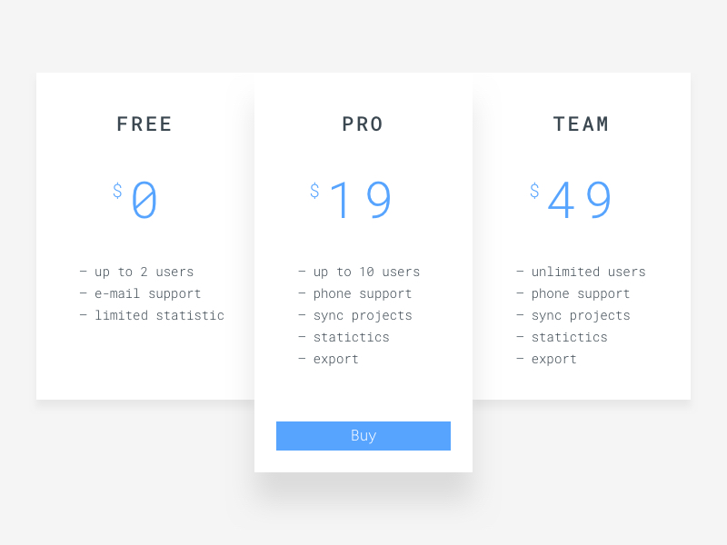

# Frontend Mentor - Minimal Pricing Tiers Challenge

Design by: [Oleg Frolov](https://dribbble.com/Volorf)

Welcome! Thanks for checking out this front-end coding challenge. 

Your task is to build out the project to the design inside the `/design` folder.

The design shows one 'Buy' call-to-action, whereas you'll see that each tier has a Buy button in the `index.html`. As part of the challenge, make it so that the styles change depending on the pricing tier that is being hovered over by the user. Style guidelines are as follows:

- Middle tier should be selected/active on page load
- The Buy call-to-action should appear for the tier that has been hovered and the buttons on the inactive tiers should disappear
- The `box-shadow` on the hovered tier should be changed to add emphasis to the element

Try to complete the JavaScript side of the project **without loading in jQuery**.

If you decide to push the project live, tweet **@frontendmentor** once you're finished with your URL in the tweet. I'd love to take a look at what you've built!

Feedback is always welcome, so if you have any regarding this challenge please email me at matt[at]frontendmentor[dot]io.

Have fun building!

## Styleguide

### Colours
- Primary: `rgb(87,164,255)`
- Body Background: `rgb(245,245,245)`

### Shades
- Light: `rgb(255,255,255)`
- Dark: `rgb(59,71,80)`

### Typography
#### Font Family
- [Roboto Mono](https://fonts.google.com/specimen/Roboto+Mono)

#### Font Weights
- 300
- 500